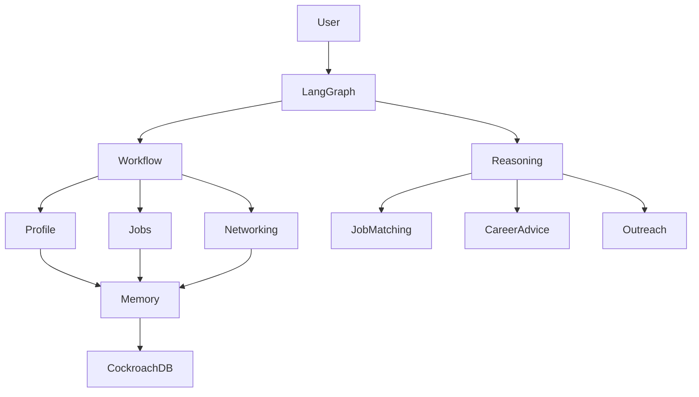
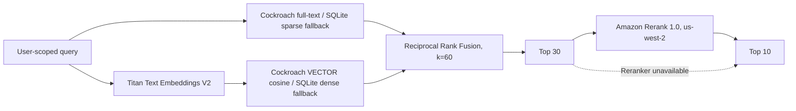

# CareerTrace AI

CareerTrace AI is a memory-powered AI career assistant that helps students discover opportunities, understand job fit, connect with alumni, personalize applications, and manage networking workflows.

The project uses **LangGraph** to combine deterministic workflows with bounded AI reasoning:

- **Deterministic workflows** handle reliable business processes (profile management, database updates, approvals).
- **AI reasoning agents** handle tasks that require flexibility (career advice, job matching explanations, personalized recommendations).

The production architecture supports persistent memory and hybrid retrieval with **CockroachDB (SQL, full-text search, and vector search)**; SQLite remains the local development and unit-test backend.

---

# Project Architecture

## High-level design



---

# Workflow Design

The system follows an approximately:

```
80% Controlled Workflow
20% Autonomous Reasoning
```

The goal is not to create a fully autonomous agent that makes uncontrolled decisions. Instead, AI reasoning is used only where it provides value.

---

## Controlled Workflow (Deterministic)

These steps follow predictable rules:

### Profile Management

- Upload resume
- Extract resume text
- Extract profile facts
- Ask user for confirmation
- Save confirmed information
- Return the confirmed profile to the dashboard


### Job Search

- Retrieve user profile
- Apply hard filters
- Calculate structured match scores
- Save recommended jobs
- Ask user for selection


Hard filters include:

- Graduation year mismatch
- Location restrictions
- Work authorization requirements
- Internship/full-time mismatch


### Networking

- Retrieve alumni information
- Check previous interactions
- Track outreach status
- Schedule follow-ups


---

## AI Reasoning Components

These tasks require flexible reasoning:

### Career Intelligence

- Explain why a job matches a user
- Identify transferable skills
- Recommend possible career directions
- Suggest missing skills


### Job Search Agent

- Expand user requests into related roles
- Generate better search queries
- Rank opportunities
- Decide which recommendations are most relevant


### Networking Agent

- Find meaningful alumni connections
- Analyze shared experiences
- Generate personalized outreach messages


---

# Current Implementation

## Completed

### Profile Onboarding Workflow

Current LangGraph flow:

```
START
 |
 v
Store Original Documents in Private S3
 |
 v
Extract and Combine Document Text
 |
 v
LLM Extract Facts
 |
 v
Validate Required Fields
 |
 +---- missing ----> Collect Missing Information
 |
 v
Editable User Confirmation
 |
 v
Save Profile to SQL
 |
END
```

The workflow currently supports:

- Google OpenID Connect login, recoverable per-workspace judge users, and
  UUID-backed multi-user isolation
- Multi-document PDF and DOCX upload to private S3
- Resume, portfolio, transcript, certificate, and other document classification
- Combined extraction merged with the current confirmed SQL profile
- Structured LLM-based profile extraction
- Required school, major, graduation year, skills, and experience validation
- Editable human confirmation using LangGraph interrupts
- Persistent SQLite profile, document, and conversation storage for local development
- Explicit checkpoint backends: SQLite locally and the official CockroachDB saver in deployment
- Internal immutable profile snapshots plus user-visible field-level history
- Profile-version links to multiple source documents
- Approved flexible memories separated from pending memory candidates
- SQL-backed, bounded Career Agent with observable tool trajectories and no automatic profile edits
- Official public-source job search with deterministic hard filtering and evidence
- Permitted people search across user connections, OpenAlex, and Wikidata
- SQL-backed resume-revision drafts and unsent outreach drafts
- No-op profile saves that do not create false versions or duplicate analyses
- Streamlit profile viewing and editing
- Per-user document upload, download, and deletion

Profile onboarding no longer generates a separate Career Analysis record. Career
reasoning belongs to Career Assistant, where the answer, sources, model metrics,
and user approval boundary can be observed and persisted.

### Stateful Career Agent

The Career Assistant is a thin facade over `app/graph/career_agent_graph.py`.
Every user request creates a user-scoped `agent_runs` row, follows a closed intent
router, loads the relevant Skill, executes a bounded structured-tool loop, and
stores only observable steps and sanitized tool calls. Hidden model reasoning is
neither displayed nor persisted.

Supported routes:

```text
START -> initialize_run -> classify_intent -> prepare_workflow
  ├── needs_input -> finalize
  ├── concise_guidance / action_plan -> agent_model
  └── job_search / people_search / resume_revision / outreach
        -> plan_action -> execute_tools -> agent_model
agent_model -> execute_tools (bounded) | finalize -> END
```

The model-visible tools are:

- `read_skill` and `read_skill_file`
- `read_evidence`
- `search_jobs` and `get_job_details`
- `search_people` and `get_person_details`
- `save_resume_revision_draft`
- `save_outreach_draft`
- `update_outreach_status` (cannot mark `sent`; that requires a UI action)

The LLM never selects `user_id`; identity is injected from trusted graph state.
Tool results remain proper `ToolMessage` objects. Source, iteration, and no-new-
result stopping conditions are enforced by code.

Search requests create a user/run-scoped SQL `search_sessions` record. Provider
cursors, source coverage, failures, calls, candidate IDs, and bounded candidate
records survive graph iterations and process restarts. Calls reserve the shared
budget before network I/O. Normal display/request count defaults to 5 and is
bounded at 10; legacy persisted values from 11–20 are safely clamped. The model
receives at most 10 summaries and can request the internal next cursor without
refetching an unchanged provider feed.

Job and people search record privacy-safe per-stage durations and counts without
raw queries or provider content. Providers run with bounded concurrency; lexical
ranking shortlists at most 30 candidates, Titan embeds at most 20 with content-
hash cache reuse and concurrency at most 4, and no per-candidate LLM calls are
made. The single final response is bounded by `AGENT_FINAL_MAX_TOKENS` (384 by
default). Official/public source authenticity and requested-requirement
verification are shown as separate statuses, and live source URLs are preserved.
`source_status` answers whether the origin is official, verified public,
unverified public, or a dated demo snapshot. `requirement_status` independently
answers whether the posting matches, conflicts with, or does not state the
user's hard requirements.

Judge Mode has a 10-second soft fallback trigger and a 12-second live search-tool
budget. When fewer than three useful live results are available after the trigger
or a provider times out, it may show committed historical public-source fixtures
under a separate **Demo snapshot suggestions** heading. Every fixture includes a
snapshot date and source URL and is explicitly not a claim of current job
availability, role, or affiliation. Google-authenticated users never receive
these fixtures; they receive bounded partial live results and provider warnings.

Hybrid retrieval follows this bounded path:



Ownership, active-version, and current-search document filters are deterministic
SQL predicates, never vector-similarity decisions. Raw retrieval queries/ranks
are not persisted unless `RETRIEVAL_DEBUG_LOGGING=true`; debug logging is
user-scoped, bounded, and optional. Approved
memories use the same retrieval path; the runtime context no longer loads every
memory.

#### Job sources and limitations

`config/job_sources.yaml` is the single version-controlled company catalog.
Sources start disabled and unverified. On 2026-08-06, public Greenhouse GET
endpoints were validated for the enabled catalog entries; unverified companies
remain disabled rather than receiving guessed ATS identifiers. Lever and official
public-page adapters are available when a validated catalog record selects them.
Tavily is optional discovery-only input: each discovered URL is validated and
independently fetched before it can become evidence. Playwright is a disabled-by-
default fallback for a known validated JS-only URL. Firecrawl is not integrated.

Job fields are normalized without inference. Supplied hard requirements use
`MATCH` / `CONFLICT` / `UNKNOWN`: conflicts are excluded, while any unknown hard
field stays in **Requirements not fully verified** and does not count toward the
verified target. Desired skills remain soft preferences; skill gaps are only
explicit posting requirements absent from confirmed profile skills. Eligible
current-session candidates are indexed and ordered by sparse + Titan dense
retrieval, RRF, and optional Amazon Rerank. No source adapter applies to a job.

#### People sources and limitations

People Search accepts optional private manual/CSV connections and searches
OpenAlex for academic discovery or Wikidata for public identity discovery. CSV
imports are user-scoped, row-limited, field-limited, and reject executable
spreadsheet formulas. LinkedIn, protected directories, inferred email patterns,
phone numbers, private addresses, and data brokers are prohibited. Recruiter
results require explicit public recruiting/talent-acquisition role evidence.

#### Drafts and approval boundaries

A **Profile Revision Draft** is a review-only proposal to change one or more
canonical Profile fields, usually extracted at a conversation boundary. Saving
accepted fields creates one immutable Profile version and field revisions; a
no-op creates no version. A **Resume Revision Draft** is a proposed output
artifact based on a specific Profile version. It never changes the Profile or
the original S3 document. These two draft types are deliberately unrelated.

Resume revisions are structured SQL drafts linked to an immutable profile version
and do not modify the profile or original S3 document. Outreach is saved with
status `draft` and no sending side effect. Only an explicit user UI action can
mark outreach `sent`, which records `sent_at`.

#### Evidence and context

Every external source result receives an `ev_<uuid>` evidence ID, URL, retrieval
time, hash, excerpt, and provenance. Small evidence stays in SQL. Evidence above
`EVIDENCE_S3_THRESHOLD_BYTES` is gzip-compressed into the existing S3 bucket at
`agent-evidence/{user_id}/{run_id}/...`; safe SQL fallback is bounded and warnings
are retained.

The immutable system prompt contains no user data. A fresh `<runtime_context>`
block supplies the current profile, a small query-relevant set of approved
memories, task, selected entities,
loaded Skills, and one current status per model call. Adaptive compression starts
only above the configured threshold, preserves evidence IDs and hard constraints,
and stores a query-aware summary boundary while leaving original SQL messages
unchanged.

---

# Persistence Foundation

Current local SQL storage:

```
SQLite
 ├── users
 ├── profiles
 ├── career_preferences
 ├── skills
 ├── projects
 ├── experience
 ├── career_analysis
 ├── career_analysis_versions
 ├── profile_versions
 ├── profile_document_sources
 ├── documents
 ├── memory_candidates
 ├── memories
 ├── conversations
 ├── messages
 ├── agent_runs / agent_steps / agent_tool_calls
 ├── agent_evidence
 ├── search_sessions / search_source_progress
 ├── retrieval_documents / retrieval_query_logs
 ├── starred_qa_pairs
 ├── conversation_context_summaries
 ├── user_connections
 ├── resume_revision_drafts / resume_revision_changes
 └── outreach_drafts
```

Supported production storage:

```
CockroachDB
 ├── SQL application and durable search state
 ├── TSVECTOR / TSQUERY sparse retrieval
 └── VECTOR(1024) dense retrieval
```

---

# Planned Development

## Job Search Agent

Flow:

```
User Request
      |
      v
Retrieve Profile
      |
      v
Apply Filters
      |
      v
Match Jobs
      |
      v
Explain Fit
      |
      v
Save Candidates
```

---

## Alumni Networking Agent

Flow:

```
Company / Job Target
        |
        v
Find Alumni
        |
        v
Analyze Connection
        |
        v
Generate Outreach
        |
        v
Track Follow-up
```

---

# Memory Architecture

CareerTrace uses two distinct durable concepts: canonical Profile facts and
approved flexible Memory.

## Profile and structured application state (SQL)

The Profile stores current reliable facts such as school, major, graduation
year, skills, projects, experience, and career preferences. Every accepted
change creates an immutable Profile snapshot plus field-level history. The
Profile is never automatically edited from conversation.

SQL also stores:

- User profile
- Skills
- Projects
- Education
- Jobs
- Applications
- Alumni contacts
- Outreach history
- User preferences


## Approved flexible Memory and semantic retrieval

Memory stores user-approved goals, preferences, constraints, and dated events.
`memory_candidates` are temporary AI suggestions created only from explicit
durable conversation signals at a boundary. Candidates follow
`pending -> approved` or `pending -> rejected`; update/conflict/revoke operations
remain pending until explicit review. Only approved active memories are indexed
and retrieved. Superseded/revoked rows remain audit history but are inactive.

Semantic retrieval also covers:

- Resume sections
- Project descriptions
- Job descriptions
- Alumni profiles
- Previous recommendations
- User feedback/rejected suggestions

Conversation memory is extracted only at a conversation boundary: switching or
starting a conversation processes the pending segment immediately, while logout
marks it for non-blocking recovery at the next login. Short segments use their
original messages; longer segments use signal-selected surrounding exchanges,
bounded by `MEMORY_EXTRACTION_MAX_INPUT_TOKENS` (default `6000`). A successful
run advances its watermark, so retries do not duplicate already-processed
messages.

Conversation-derived profile changes and flexible memories are review-first.
Profile facts appear as field-level revision drafts. Flexible memories appear as
`ADD`, `UPDATE`, `REVOKE`, or `CONFLICT` candidates. Rejected candidates are
never indexed; approved memories show an explicit retrieval index status.
Superseded and revoked memories remain in SQL audit history but are inactive and
excluded from retrieval.

Within the active conversation, explicit recent profile/memory signals form a
current-thread overlay so the assistant can stay coherent before boundary
review. That overlay is not durable Profile or Memory and cannot mutate SQL by
itself. At a conversation switch/start boundary, only explicit durable signals
are extracted into review candidates. Logout marks pending extraction for safe
recovery on the next login.

Career Assistant uses progressive disclosure rather than injecting all memory.
It first projects only intent-relevant fields from the current SQL Profile, then
searches a catalog of at most ten compact approved-memory cards, and expands at
most three relevant active memories. Source conversation ranges are loaded only
for an explicit temporal, conflict, or provenance need and are bounded to two.
The response UI shows collapsed Personalization references containing only the
stable Profile fields and approved memory IDs actually loaded for that run.

The UI keeps these stores separate: My Profile owns current facts, pending field
updates, and field history; Memory owns flexible candidates and approved
memories; Career Assistant owns conversation history.

---

# LLM Architecture

The project uses different models depending on the task.

```
                 LangGraph

                     |
        +------------+------------+
        |                         |
        v                         v

   Nova Lite              Claude Sonnet

 Cheap / fast             Strong reasoning

 Profile extraction       Job ranking
 Intent detection         Career advice
 Query parsing            Resume tailoring
 Metadata extraction      Outreach writing
```

The goal is to use cheaper models for high-volume simple tasks and stronger models only when deeper reasoning is needed.

---

# Project Structure

```
careertrace-ai/

├── app/
│   ├── main.py
│   │
│   ├── graph/
│   │   ├── checkpoint.py
│   │   └── profile_graph.py
│   │
│   ├── nodes/
│   │   ├── resume.py
│   │   ├── extraction.py
│   │   ├── confirmation.py
│   │   ├── validation.py
│   │   ├── profile.py
│   │   └── memory.py
│   │
│   ├── database/
│   │   ├── database.py
│   │   ├── models.py
│   │   └── repository.py
│   ├── auth/
│   │   ├── google_oauth.py
│   │   └── session.py
│   ├── services/
│   │   ├── career_assistant.py
│   │   └── documents.py
│   ├── storage/
│   │   ├── base.py
│   │   └── s3.py
│   │
│   ├── ui/
│   │   └── dashboard.py
│   │
│   ├── llm/
│   │   └── model.py
│   │
│   └── state/
│       └── schema.py
│
├── migrations/
├── demo/
│   ├── Demo_Resume.pdf
│   └── Demo_Portfolio.pdf
├── infra/
│   ├── s3-bucket.yaml
│   └── application-s3-policy.json
├── data/  # local runtime files are ignored by Git
│
├── tests/
├── requirements.txt
├── README.md
└── .gitignore
```

---

# Setup

## 1. Clone repository

```bash
git clone <repository-url>

cd careertrace-ai
```

---

## 2. Create virtual environment

CareerTrace is tested on Python 3.13 and supports Python 3.12–3.13.

```bash
python -m venv .venv
```

Activate:

### Mac/Linux

```bash
source .venv/bin/activate
```

---

## 3. Install dependencies

```bash
pip install -r requirements.txt
```

---

## 4. Configure environment variables

Create:

```
.env
```

Example:

```env
# AWS Bedrock
AWS_REGION=us-east-1

BEDROCK_MODEL_CHEAP=amazon.nova-lite-v1:0
BEDROCK_MODEL_REASONING=global.anthropic.claude-sonnet-4-6
BEDROCK_COUNT_TOKENS_MODEL=anthropic.claude-sonnet-4-20250514-v1:0
BEDROCK_EMBEDDING_MODEL=amazon.titan-embed-text-v2:0
BEDROCK_EMBEDDING_DIMENSIONS=1024
BEDROCK_RERANK_ENABLED=false
BEDROCK_RERANK_REGION=us-west-2
BEDROCK_RERANK_MODEL_ID=amazon.rerank-v1:0


# LangSmith tracing
LANGSMITH_TRACING=true
LANGSMITH_API_KEY=
LANGSMITH_PROJECT=CareerTrace

# Local SQL memory
DATABASE_URL=sqlite:///data/careertrace.db
LANGGRAPH_CHECKPOINT_BACKEND=sqlite
LANGGRAPH_CHECKPOINT_DB=data/langgraph_checkpoints.sqlite
LANGGRAPH_CHECKPOINT_SCHEMA=careertrace_checkpoints

# Private S3 document storage
S3_BUCKET_NAME=careertrace-resumes
S3_REGION=us-east-1
MAX_DOCUMENT_SIZE_MIB=10

# Google OpenID Connect
GOOGLE_CLIENT_ID=<google-client-id>
GOOGLE_CLIENT_SECRET=<google-client-secret>
AUTH_COOKIE_SECRET=<strong-random-cookie-signing-secret>
OAUTH_REDIRECT_URI=http://localhost:8501/oauth2callback

# Optional Judge Demo entry (deployment secrets; never commit real values)
JUDGE_DEMO_ENABLED=false
JUDGE_DEMO_ACCESS_CODE=<shared-hackathon-access-code>

# Optional discovery / rendering
TAVILY_ENABLED=false
TAVILY_API_KEY=
PLAYWRIGHT_ENABLED=false

# Developer-only read-only managed MCP diagnostics
COCKROACH_CLOUD_MCP_ENABLED=false
COCKROACH_CLOUD_MCP_URL=https://cockroachlabs.cloud/mcp
COCKROACH_CLOUD_CLUSTER_ID=
COCKROACH_CLOUD_MCP_API_KEY=
```

The tested CareerTrace reasoning configuration uses the Bedrock inference-profile
identifier `global.anthropic.claude-sonnet-4-6`. Some Bedrock models cannot be
invoked with on-demand throughput through a bare foundation-model ID. Supply the
appropriate inference-profile ID or ARN for the deployment region; do not assume
that the underlying foundation-model ID works on every reasoning path.

Bedrock may support generation through an inference profile while rejecting that
profile in the CountTokens API. `BEDROCK_COUNT_TOKENS_MODEL` is a direct,
provider-supported tokenizer model used only for preflight accounting; it never
changes the model that generates CareerTrace responses.

`LANGSMITH_*` names are the canonical public tracing contract. The LangSmith SDK
continues to accept historical `LANGCHAIN_*` aliases, but new deployments should
use the canonical names above.

For local development, use SQLite for application SQL and
`LANGGRAPH_CHECKPOINT_BACKEND=sqlite`. For deployed Judge mode, both durable
application SQL and workflow recovery must use CockroachDB:

```env
DATABASE_URL=cockroachdb://<application-user>:<password>@<host>:26257/<database>?sslmode=verify-full
LANGGRAPH_CHECKPOINT_BACKEND=cockroachdb
LANGGRAPH_CHECKPOINT_SCHEMA=careertrace_checkpoints
```

The checkpoint schema is created automatically and managed by
`CockroachDBSaver`. The same Profile graph is compiled in both modes. See
[the compatibility record](docs/CHECKPOINT_COMPATIBILITY.md), including why the
generic Postgres saver is not used.

Register the exact `OAUTH_REDIRECT_URI` as an authorized redirect URI in the
Google OAuth client. Generate a cookie secret with:

```bash
python -c "import secrets; print(secrets.token_urlsafe(48))"
```

Credentials stay server-side. Streamlit's native OIDC implementation validates
authorization state and nonce; CareerTrace additionally validates the Google
issuer, audience, authorized party, verified email, issue time, and expiration.

If controlled JavaScript rendering is required, explicitly install the browser
binary and then enable it. Application startup never performs this installation:

```bash
python -m playwright install chromium
```

See [Third-Party Integrations](docs/THIRD_PARTY_INTEGRATIONS.md) for provider,
data, retention, terms, and regional-processing boundaries.

CareerTrace uses three separate CockroachDB concepts:

- **Distributed vector/full-text indexing** is a runtime retrieval capability.
- **CockroachDB Cloud Managed MCP** is a bounded, read-only developer operations
  integration and never enters the Career Agent tool surface.
- **CockroachDB Agent Skills** are developer engineering guidance used to audit
  transactions, SQL, diagnostics, and privileges. They are not runtime data,
  model training data, or end-user Skills. The exact upstream revision and
  findings are recorded in [the Skills audit](docs/COCKROACH_AGENT_SKILLS.md).

### Required and optional integrations

Local Judge testing requires one configured login path (enabled Judge access or
complete Google OIDC), SQL, AWS Bedrock, and private S3. Deployed Judge mode
requires CockroachDB for application/checkpoint persistence and S3 for documents
and evidence; a cloud-local SQLite file is not durable product storage. AWS
credentials come from the standard boto3 chain: an AWS profile, environment
credentials, or an IAM role/workload identity. Credentials do not need to be
stored in `.env`.

Tavily discovery, Playwright rendering, Bedrock Rerank, LangSmith tracing, and
Cockroach Cloud MCP diagnostics are optional when explicitly disabled. MCP is a
developer-only diagnostic integration and never an end-user Agent tool.

## 5. Provision private S3 storage

An AWS administrator with bucket-provisioning permissions can deploy the
included retained, encrypted, public-access-blocked bucket:

```bash
aws cloudformation deploy \
  --region us-east-1 \
  --stack-name careertrace-document-storage \
  --template-file infra/s3-bucket.yaml \
  --parameter-overrides BucketName=careertrace-resumes
```

Attach `infra/application-s3-policy.json` to the application role or user. It
allows only `PutObject`, `GetObject`, and `DeleteObject` beneath the bucket.
The 10 MiB maximum is enforced before the backend sends a request to S3.

## 6. Run the setup doctor

The setup doctor uses only synthetic probes, sanitizes provider errors, and
never prints secret values or connection URLs:

```bash
python scripts/check_setup.py --mode local
```

For deployment configuration validation, use `--mode deployed`. To validate
only variable presence without making network calls, add
`--configuration-only`. Exit status is nonzero when a required check fails.

## 7. Optional Docker setup

Docker is an additional reproducible path; secrets are supplied only at runtime:

```bash
docker build -t careertrace-ai .
docker run --rm -p 8501:8501 --env-file .env careertrace-ai
curl --fail http://localhost:8501/_stcore/health
```

The container listens on `0.0.0.0:8501` and includes a Streamlit health check.
Do not copy `.env` or `.streamlit/secrets.toml` into the image.

Phase 7's exact portability evidence is recorded in
[docs/PHASE7_VALIDATION.md](docs/PHASE7_VALIDATION.md). For public deployment,
follow the secret-safe [Streamlit Community Cloud guide](docs/STREAMLIT_CLOUD_DEPLOYMENT.md)
and start from [the public TOML template](docs/streamlit-secrets.example.toml).

---

# Running CareerTrace

## Web interface

Start the Streamlit application from the repository root:

```bash
streamlit run app/ui/dashboard.py
```

The web interface provides:

- Google login, judge-demo access, and logout
- Multi-document PDF/DOCX onboarding
- Missing-field collection and final profile review
- Database-backed profile viewing and editing
- Career preferences
- Starred question/answer pairs, independent from career preferences
- Private per-user document management
- Field-level profile restore that creates a new current snapshot on Save
- Approved-memory review and persistent Career Assistant conversations
- Sidebar agent status, evidence-backed candidate results, saved drafts, and optional connections

## Judge Testing Instructions

Use the deployed CareerTrace URL supplied with the hackathon submission. For a
local review, the demo URL is `http://localhost:8501` after starting Streamlit.

1. Open the demo URL and click **Try Judge Demo**.
2. Enter the shared Demo Access Code supplied privately with the hackathon
   submission. No Google account or OAuth test-user allowlisting is required.
3. Click **Start New Workspace**. Copy the one-time `CT-XXXX-XXXX-XXXX-XXXX`
   recovery code and store it securely; CareerTrace stores only its hash.
4. Confirm the **Demo workspace — uses synthetic data** label is visible. This
   refers to the supplied test documents; no profile or analysis is pre-seeded.
5. On **Documents**, open **Upload & Analyze** and download
   `Demo_Resume.pdf` and `Demo_Portfolio.pdf`.
6. Upload both files together, select their document types, and click
   **Analyze documents**.
7. Complete required-field collection and review the merged profile before
   selecting **Confirm and save**.
8. Explore **My Profile** (including pending updates and field history), **Starred Q&A**,
   **Documents** (including **Stored Documents**), **Memory**, and
   **Career Assistant**.
9. In **Career Assistant**, try a structured request such as “Find 5 AI
   engineering internships in California.” Live results retain clickable source
   links. If judge-only fallback is needed, historical samples appear separately
   as **Demo snapshot suggestions**.
10. Use **Logout** to clear the active browser identity. To return, click
    **Try Judge Demo**, open **Resume Existing Workspace**, and enter both the
    shared access code and the workspace recovery code.

Each new judge workspace creates a distinct ordinary UUID-backed `users` row
marked as a demo identity. The shared entry code gates workspace controls but is
not an administrator bypass. A SHA-256 digest of the high-entropy recovery code
maps back to that one demo UUID; plaintext recovery codes are never written to
SQL or logs. Logout does not delete the workspace, profile, pending reviews,
memories, conversations, messages, or document metadata. Judge workspaces use
the same S3, LangGraph, validation, confirmation, SQL repository, versioning,
and Bedrock paths as Google-authenticated users, with every operation scoped to
the recovered UUID. The supplied documents are wholly synthetic and contain no
real personal information.

The committed demo PDFs can be reproduced with:

```bash
python scripts/generate_demo_documents.py
python -m scripts.build_demo_search_fixtures --limit 10
```

## Command-line workflow

The CLI also requires S3 configuration and accepts a PDF or DOCX:

```
data/
```

Example:

```
data/resume.pdf
```

Run:

```bash
python -m app.main data/resume.pdf --name "Ada Student" --email ada@example.com
```

The workflow will:

1. Extract resume information
2. Ask for required missing information
3. Ask for final confirmation
4. Save the profile to SQLite
5. Generate and save career analysis

---

# SQL Memory Design

Graph nodes, authentication, document services, and the UI access SQL through
`app/database/repository.py`; they do not issue SQLite-specific queries.
`DATABASE_URL` and engine creation are isolated in `app/database/database.py`.
Alembic migrations run on application startup.

Relative SQLite paths are resolved against the repository root, so launching
Streamlit from another directory does not silently open a different database.
Completed user memory is always read from SQL. Locally,
`LANGGRAPH_CHECKPOINT_DB` is a separate SQLite file used only to resume
interrupted workflows. In deployed Cockroach mode, the official
`CockroachDBSaver` persists checkpoints in `LANGGRAPH_CHECKPOINT_SCHEMA`; no
local file, Streamlit session, or old Python process is required for recovery.

Profile facts are written to immutable `profile_versions` JSON snapshots.
`profiles.current_version_id` selects the active snapshot, and
`profile_document_sources` records all supporting documents.
`profile_field_revisions` is the field-scoped audit layer; restoring an old field
value is a preview followed by a normal Save, never a whole-profile rollback.
Legacy career-analysis tables and historical data remain for compatibility, but
career analysis is no longer generated during onboarding or rendered in the
active product UI. Career advice now belongs to Career Assistant and useful
answers can be retained with Starred Q&A.

To run against an isolated CockroachDB database:

1. Provision CockroachDB and set a Cockroach-compatible `DATABASE_URL`.
2. Run the existing Alembic migrations against the CockroachDB URL.
3. Run the optional `COCKROACH_TEST_DATABASE_URL` integration suite against a
   separate disposable database before production rollout.
4. Keep graph nodes, storage service contracts, and Streamlit views unchanged.

The configured test database must be disposable and clearly named as a test
database. The fresh-migration proof intentionally resets only that database's
application tables before running Alembic to head; never point
`COCKROACH_TEST_DATABASE_URL` at production.

Application-generated UUID keys and transaction-scoped profile writes are used
to keep the schema portable to a distributed SQL deployment.

---

# Development Notes

## Developer CockroachDB operations

The end-user Career Agent never receives database administration tools. Optional
developer diagnostics use the official CockroachDB Cloud Managed MCP endpoint
through the public MCP Python SDK, pin one configured cluster, and enforce a
CareerTrace-side allowlist for bounded read-only `SELECT`/`EXPLAIN` operations.
CockroachDB's official operational Skills are published at
[`cockroachlabs/cockroachdb-skills`](https://github.com/cockroachlabs/cockroachdb-skills)
and belong in a developer tool's `.agents/skills`/personal skill catalog—not
`app/skills`, which contains only CareerTrace product workflows.

## Current priority

1. Validate transaction-retry behavior against the selected CockroachDB tier
2. Backfill embeddings for existing approved private corpus records
3. Add scheduled proactive searches and notifications
4. Add PDF/DOCX resume-draft export
5. Add separately approved sending and application actions

---

# Technology Stack

- **LangGraph** — agent workflow orchestration
- **Amazon Bedrock** — LLM inference
- **LangSmith** — tracing and debugging
- **CockroachDB** — supported production persistence and retrieval schema
- **Hybrid Search** — Cockroach full-text + Titan embeddings + RRF + Amazon Rerank
- **Streamlit** — authenticated web interface
