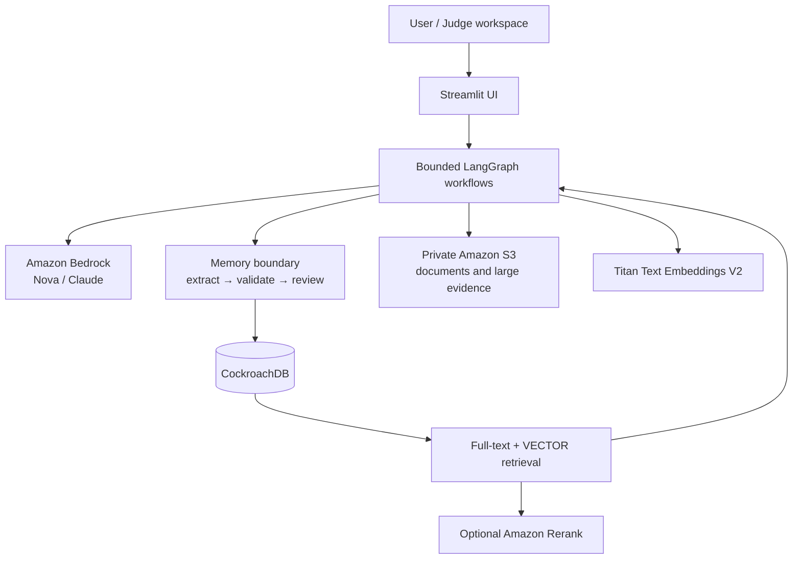
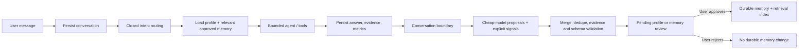

# CareerTrace AI

CareerTrace AI is a persistent-memory career assistant for students and early-career candidates. It turns confirmed resumes and user-approved conversation details into durable career context, then uses that context to personalize guidance, job discovery, people discovery, resume drafts, and outreach drafts without silently changing the user's profile or sending actions on the user's behalf.

Built for the [**CockroachDB × AWS Hackathon — Build with Agentic Memory**](https://cockroachdb-ai.devpost.com/rules), CareerTrace uses CockroachDB for application state, profile history, semantic and episodic memory, hybrid retrieval, and deployed LangGraph checkpoints. AWS provides model inference, embeddings, reranking, and private document storage.

## Demo

- **Live demo:** _Add the final public AWS deployment URL before submission._
- **Judge access:** Select **Try Judge Demo**. No Google allowlisting is required.
- **Test data:** Use the synthetic files in [`demo/`](demo/). Judge workspaces are empty at creation and do not contain pre-seeded personal data.
- **Suggested flow:** upload both demo documents → confirm the extracted profile → ask Career Assistant for matching roles → state a durable preference → start another conversation to trigger extraction → approve the pending memory → ask a follow-up that uses it.
- **Screenshots/video:** _Add the Devpost screenshots and public demo-video URL before submission._

Judge workspaces use distinct UUID identities and the normal S3, Bedrock, SQL, retrieval, and approval paths. A one-time recovery code can reopen the same workspace; only its hash is stored.

## Problem

Career planning unfolds across resumes, projects, goals, constraints, applications, and many conversations. Most chat assistants lose that context or keep it as an opaque transcript.

That creates repetitive and unreliable experiences:

- candidates repeatedly explain their education, skills, and goals;
- preferences such as location or work style are easily forgotten;
- completed and planned career events become disconnected from later advice;
- inferred facts can be mistaken for confirmed facts;
- recommendations lack a durable, auditable source of truth.

## Solution

CareerTrace separates career context by trust and purpose:

- **Profile facts** are structured, versioned, and linked to source documents.
- **Semantic memories** capture approved preferences, goals, constraints, interests, values, and other durable context.
- **Career events** record approved completed, current, planned, or unknown-status events.
- **Conversation signals and memory candidates** remain reviewable working data until the user approves them.
- **Hybrid retrieval** selects only relevant, user-scoped context instead of placing the entire history in every prompt.

The result is an assistant that can remember useful context across sessions while preserving user control.

## Architecture



The agent is intentionally controlled rather than fully autonomous. LangGraph routes requests through a closed set of workflows, enforces iteration and source-call limits, and keeps deterministic validation and persistence outside the model.

## Memory Architecture

### Profile Memory

Profile Memory contains canonical facts such as education, school, major, graduation year, skills, projects, and experience.

- `profile_versions` stores immutable snapshots.
- `profiles.current_version_id` selects the active version.
- `profile_document_sources` links a version to supporting S3 documents.
- `profile_field_revisions` provides field-level history.
- Resume onboarding requires editable human confirmation before saving.
- Conversation-derived profile changes become reviewable profile drafts; conversations do not directly overwrite the Profile.

### Semantic Memory

`semantic_memories` stores subjective, durable context that should personalize future assistance but does not belong in the canonical Profile.

- Each memory has an open, normalized `semantic_group`, such as `preference`, `goal`, `constraint`, `interest`, or `work_style`.
- `topic_key` identifies a reusable topic when classification is specific enough.
- Updates preserve history through same-type supersession links.
- Source conversation, source message IDs, exact evidence text, active/revoked state, and indexing status remain attached.

Semantic groups are intentionally not a closed enum; the extractor may propose a normalized new group when existing groups do not fit.

### Episodic Career Memory

`career_events` stores durable career events separately from semantic context.

- Events can be `completed`, `current`, `planned`, or `unknown`.
- Temporal values are accepted only when grounded in the source statement.
- Same-type event supersession preserves timeline history.
- `career_paths` provides a schema for grouping events into longer-running paths. The current product retrieves career events directly; automated path grouping is not yet an end-user workflow.

### Retrieval

Approved Profile, Semantic Memory, and Career Event records are indexed into a shared `retrieval_documents` corpus:

1. Text is structure-aware chunked.
2. Amazon Titan Text Embeddings V2 produces 1,024-dimensional embeddings.
3. CockroachDB full-text search and distributed vector search run independently.
4. Reciprocal Rank Fusion combines both rankings.
5. Amazon Rerank can rerank the shortlist when enabled; retrieval still works when reranking or embeddings are unavailable.
6. The agent receives bounded memory cards first and can load details for at most three selected memories.

Every private retrieval query includes the trusted application `user_id`; the model cannot select or override it.

## Agent Workflow



Key controls:

- The LLM performs semantic classification; deterministic code validates evidence ownership, offsets, types, and schema boundaries.
- LLM and explicit-signal proposals share one representation and are deduplicated before review.
- Only exact, self-owned evidence from user messages can become a candidate.
- Profile facts win when information belongs in the canonical Profile.
- Pending extraction boundaries and extraction runs are persisted and recoverable after logout or restart.
- The Career Agent has bounded iterations, bounded source calls, observable tool trajectories, and no direct database-administration tools.
- Resume revisions and outreach messages are saved as drafts. Sending remains a separate user action.

## CockroachDB Integration

CockroachDB is the production memory and state layer—not a demonstration-only query target.

| Capability | CareerTrace use |
|---|---|
| Distributed SQL transactions | Users, profiles, immutable versions, conversations, candidates, approved memories, events, searches, drafts, and agent runs |
| JSON | Profile snapshots, structured memory values, provenance, tool results, and retrieval metadata |
| Full-text search | Stored `TSVECTOR` column with an inverted index over retrieval documents |
| Distributed Vector Indexing | `VECTOR(1024)` Titan embeddings with a cosine vector index |
| LangGraph persistence | Official `CockroachDBSaver` in an isolated checkpoint schema |
| Alembic migrations | Additive schema evolution and legacy-memory backfill with validation and retry-safe copying |

Why CockroachDB fits CareerTrace:

- memory and operational state remain in one distributed SQL system, while retrieval-index failures are recorded for retry;
- SQL, JSON, full-text, and vector retrieval avoid a separate vector database;
- user-scoped rows and foreign keys provide clear ownership boundaries;
- durable checkpoints and application state survive process replacement;
- immutable versions and supersession links retain history instead of overwriting it.

### Hackathon CockroachDB tools

CareerTrace uses two tools listed by the hackathon:

1. **CockroachDB Distributed Vector Indexing** powers production dense retrieval alongside Cockroach full-text search.
2. **CockroachDB Agent Skills Repo** was used as developer guidance to audit schema design, migration safety, query behavior, least-privilege boundaries, and production diagnostics. The resulting controls are recorded in [`docs/COCKROACH_AGENT_SKILLS.md`](docs/COCKROACH_AGENT_SKILLS.md).

The repository also contains an optional, disabled-by-default wrapper for **CockroachDB Cloud Managed MCP**. It is limited to developer-only, read-only system metadata and is never exposed to the Career Agent; it is not required for the product workflow.

## AWS Deployment

### Implemented AWS services

- **Amazon Bedrock:** Nova Lite for lower-cost structured work and a stronger reasoning model for agent responses.
- **Amazon Titan Text Embeddings V2:** retrieval embeddings.
- **Amazon Rerank 1.0:** optional final shortlist reranking in `us-west-2`.
- **Amazon S3:** encrypted, private resume/portfolio and large-evidence storage. Public access is blocked and insecure transport is denied.
- **AWS credential provider chain:** credentials are supplied at runtime; no AWS keys are stored in source code.

The repository includes a production Dockerfile, container health check, S3 CloudFormation template, and least-privilege S3 object policy.

### Container deployment path

The intended AWS container topology is:

```text
ECR image
   ↓
ECS service / task
   ├── Secrets Manager → runtime configuration
   ├── Bedrock and Titan
   ├── private S3 bucket
   └── CockroachDB Cloud over TLS verify-full
```

The committed repository does **not** currently include ECS service/task infrastructure, ECR publishing automation, or Secrets Manager wiring. Those resources must be provisioned and the public ECS URL added above before claiming ECS deployment. The currently documented public-hosting procedure is in [`docs/STREAMLIT_CLOUD_DEPLOYMENT.md`](docs/STREAMLIT_CLOUD_DEPLOYMENT.md).

Cockroach connections use `sslmode=verify-full`. A deployment CA certificate can be supplied as `COCKROACH_CA_CERT`; CareerTrace materializes it to a restrictive temporary file and uses the same resolved URL for SQLAlchemy and `CockroachDBSaver`.

## Production Readiness

- **Approval boundary:** extracted memories remain candidates until accepted; rejected candidates do not modify durable memory.
- **Provenance:** review candidates retain their extraction run and exact offsets; approved records retain source conversation, message IDs, evidence text, and indexing status.
- **Identity isolation:** Google and Judge identities map to UUID `user_id` values. Repository operations scope private reads and writes to the active user.
- **Durable recovery:** CockroachDB stores product state and deployed LangGraph checkpoints; browser session state is not the source of truth.
- **Safe failure modes:** sparse retrieval remains available when embeddings fail, indexing failures are recorded, and tool/provider errors are sanitized.
- **Observability:** agent runs, bounded tool trajectories, search phases, token metrics, and optional LangSmith traces are persisted without hidden chain-of-thought.
- **TLS and secrets:** secrets stay in runtime configuration; Cockroach TLS remains `verify-full`; certificates and passwords are not logged.
- **Migration safety:** Alembic manages schema state. Migration `20260817_17` validates legacy classification, same-type supersession, counts, and orphan links. [`scripts/validate_cockroach_memory_migration.py`](scripts/validate_cockroach_memory_migration.py) runs the real migration path in a disposable Cockroach database before production rollout.

## Local Development

### Requirements

- Python 3.13
- AWS credentials with access to the configured Bedrock models and private S3 bucket
- SQLite for local development, or a separate CockroachDB database for integration testing

### Setup

```bash
git clone https://github.com/gluuabc/careertrace-ai.git
cd careertrace-ai

python3.13 -m venv .venv
source .venv/bin/activate
pip install -r requirements.txt
cp .env.example .env
```

Configure `.env` without committing it. At minimum, select a login path, configure the AWS region/models and S3 bucket, and keep the default SQLite URL for a local run.

Provision the included private S3 bucket if needed:

```bash
aws cloudformation deploy \
  --region us-east-1 \
  --stack-name careertrace-document-storage \
  --template-file infra/s3-bucket.yaml \
  --parameter-overrides BucketName=careertrace-resumes
```

Initialize and run:

```bash
alembic upgrade head
python scripts/check_setup.py --mode local
streamlit run app/ui/dashboard.py
```

Open `http://localhost:8501`. For Judge mode, set both `JUDGE_DEMO_ENABLED=true` and a private `JUDGE_DEMO_ACCESS_CODE`.

Run tests:

```bash
pip install -r requirements-dev.txt
pytest -q
```

Never point `COCKROACH_TEST_DATABASE_URL` or the disposable migration validator at production.

## Hackathon Requirements Mapping

| Requirement / criterion | Implementation |
|---|---|
| Agentic application | Bounded LangGraph Career Agent with closed routing, structured tools, persisted runs, and recovery boundaries |
| Persistent memory | CockroachDB Profile, Semantic Memory, Career Event, conversation, candidate, and checkpoint storage |
| Agentic Memory Design | Profile facts, subjective semantic context, and episodic career events have separate schemas and trust rules |
| CockroachDB tool 1 | Distributed Vector Indexing over Titan `VECTOR(1024)` embeddings |
| CockroachDB tool 2 | Official Agent Skills Repo applied to schema, migration, security, and operations audits |
| Technological Implementation | Cockroach full-text + vector search, RRF, optional Bedrock reranking, Alembic migrations, and official Cockroach checkpoint saver |
| AWS service | Bedrock inference, Titan embeddings, optional Amazon Rerank, and private S3 storage |
| Real-World Impact | Reduces repeated career-data entry and keeps advice consistent across resumes, goals, constraints, and career events |
| Product Readiness | Approval before durable memory, exact provenance, UUID isolation, TLS verification, observability, and disposable migration validation |
| Creativity & Originality | Treats a career as three distinct memory types with separate trust, approval, history, and retrieval rules instead of one opaque chat history |
| Functional judge access | Recoverable UUID-backed Judge workspace using synthetic documents and the normal product path |

## Future Improvements

- Provision and verify the ECS/ECR/Secrets Manager deployment path.
- Add user-managed CareerPath grouping and timeline views.
- Backfill missing embeddings with an operator-controlled job.
- Add scheduled searches and notifications with explicit opt-in.
- Add separately approved sending and application actions.

## License

CareerTrace AI is released under the [MIT License](LICENSE).
