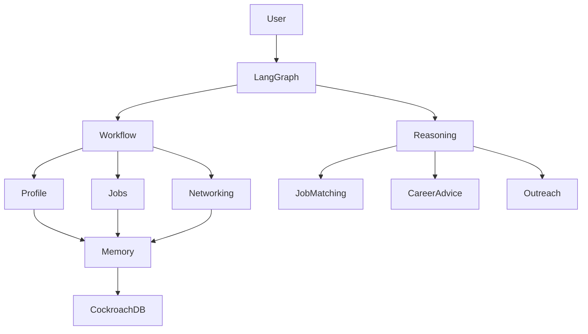

# CareerTrace AI

CareerTrace AI is a memory-powered AI career assistant that helps students discover opportunities, understand job fit, connect with alumni, personalize applications, and manage networking workflows.

The project uses **LangGraph** to combine deterministic workflows with bounded AI reasoning:

- **Deterministic workflows** handle reliable business processes (profile management, database updates, approvals).
- **AI reasoning agents** handle tasks that require flexibility (career advice, job matching explanations, personalized recommendations).

The long-term goal is to build a personalized career agent with persistent memory using **CockroachDB (SQL + Vector Search)**.

---

# Project Architecture

## High-level design



---

# Workflow Design

The system follows an approximately:

```
80% Controlled Workflow
20% Autonomous Reasoning
```

The goal is not to create a fully autonomous agent that makes uncontrolled decisions. Instead, AI reasoning is used only where it provides value.

---

## Controlled Workflow (Deterministic)

These steps follow predictable rules:

### Profile Management

- Upload resume
- Extract resume text
- Extract profile facts
- Ask user for confirmation
- Save confirmed information
- Generate career profile


### Job Search

- Retrieve user profile
- Apply hard filters
- Calculate structured match scores
- Save recommended jobs
- Ask user for selection


Hard filters include:

- Graduation year mismatch
- Location restrictions
- Work authorization requirements
- Internship/full-time mismatch


### Networking

- Retrieve alumni information
- Check previous interactions
- Track outreach status
- Schedule follow-ups


---

## AI Reasoning Components

These tasks require flexible reasoning:

### Career Intelligence

- Explain why a job matches a user
- Identify transferable skills
- Recommend possible career directions
- Suggest missing skills


### Job Search Agent

- Expand user requests into related roles
- Generate better search queries
- Rank opportunities
- Decide which recommendations are most relevant


### Networking Agent

- Find meaningful alumni connections
- Analyze shared experiences
- Generate personalized outreach messages


---

# Current Implementation

## Completed

### Profile Onboarding Workflow

Current LangGraph flow:

```
START
 |
 v
Store Original Documents in Private S3
 |
 v
Extract and Combine Document Text
 |
 v
LLM Extract Facts
 |
 v
Validate Required Fields
 |
 +---- missing ----> Collect Missing Information
 |
 v
Editable User Confirmation
 |
 v
Save Profile to SQL
 |
 v
Generate Career Analysis
 |
 v
Save Career Analysis to SQL
 |
END
```

The workflow currently supports:

- Google OpenID Connect login, per-session judge users, and UUID-backed
  multi-user isolation
- Multi-document PDF and DOCX upload to private S3
- Resume, portfolio, transcript, certificate, and other document classification
- Combined extraction merged with the current confirmed SQL profile
- Structured LLM-based profile extraction
- Required school, major, graduation year, skills, and experience validation
- Editable human confirmation using LangGraph interrupts
- Persistent SQLite profile, analysis, document, and conversation storage
- Durable SQLite LangGraph checkpoints for interrupted workflow recovery
- Immutable profile and career-analysis versions with pointer-only rollback
- Profile-version links to multiple source documents
- Approved flexible memories separated from pending memory candidates
- SQL-backed Career Assistant conversation history without automatic profile edits
- No-op profile saves that do not create false versions or duplicate analyses
- Streamlit profile viewing and editing
- Per-user document upload, download, and deletion

Example generated information:

```json
{
  "strengths": [],
  "possible_roles": [],
  "recommended_next_skills": []
}
```

---

# Persistence Foundation

Current local SQL storage:

```
SQLite
 ├── users
 ├── profiles
 ├── career_preferences
 ├── skills
 ├── projects
 ├── experience
 ├── career_analysis
 ├── career_analysis_versions
 ├── profile_versions
 ├── profile_document_sources
 ├── documents
 ├── memory_candidates
 ├── memories
 ├── conversations
 └── messages
```

Planned production storage:

```
CockroachDB
 ├── SQL tables
 └── Vector embeddings
```

---

# Planned Development

## Job Search Agent

Flow:

```
User Request
      |
      v
Retrieve Profile
      |
      v
Apply Filters
      |
      v
Match Jobs
      |
      v
Explain Fit
      |
      v
Save Candidates
```

---

## Alumni Networking Agent

Flow:

```
Company / Job Target
        |
        v
Find Alumni
        |
        v
Analyze Connection
        |
        v
Generate Outreach
        |
        v
Track Follow-up
```

---

# Memory Architecture

The agent will use two types of memory.

## Structured Memory (SQL)

Stores reliable facts:

- User profile
- Skills
- Projects
- Education
- Jobs
- Applications
- Alumni contacts
- Outreach history
- User preferences


## Semantic Memory (Vector Search)

Stores information requiring similarity search:

- Resume sections
- Project descriptions
- Job descriptions
- Alumni profiles
- Previous recommendations
- User feedback/rejected suggestions

---

# LLM Architecture

The project uses different models depending on the task.

```
                 LangGraph

                     |
        +------------+------------+
        |                         |
        v                         v

   Nova Lite              Claude Sonnet

 Cheap / fast             Strong reasoning

 Profile extraction       Job ranking
 Intent detection         Career advice
 Query parsing            Resume tailoring
 Metadata extraction      Outreach writing
```

The goal is to use cheaper models for high-volume simple tasks and stronger models only when deeper reasoning is needed.

---

# Project Structure

```
careertrace-ai/

├── app/
│   ├── main.py
│   │
│   ├── graph/
│   │   ├── checkpoint.py
│   │   └── profile_graph.py
│   │
│   ├── nodes/
│   │   ├── resume.py
│   │   ├── extraction.py
│   │   ├── confirmation.py
│   │   ├── validation.py
│   │   ├── profile.py
│   │   └── memory.py
│   │
│   ├── database/
│   │   ├── database.py
│   │   ├── models.py
│   │   └── repository.py
│   ├── auth/
│   │   ├── google_oauth.py
│   │   └── session.py
│   ├── services/
│   │   ├── career_assistant.py
│   │   └── documents.py
│   ├── storage/
│   │   ├── base.py
│   │   └── s3.py
│   │
│   ├── ui/
│   │   └── dashboard.py
│   │
│   ├── llm/
│   │   └── model.py
│   │
│   └── state/
│       └── schema.py
│
├── migrations/
├── demo/
│   ├── Demo_Resume.pdf
│   └── Demo_Portfolio.pdf
├── infra/
│   ├── s3-bucket.yaml
│   └── application-s3-policy.json
├── data/  # local runtime files are ignored by Git
│
├── tests/
├── requirements.txt
├── README.md
└── .gitignore
```

---

# Setup

## 1. Clone repository

```bash
git clone <repository-url>

cd careertrace-ai
```

---

## 2. Create virtual environment

```bash
python -m venv .venv
```

Activate:

### Mac/Linux

```bash
source .venv/bin/activate
```

---

## 3. Install dependencies

```bash
pip install -r requirements.txt
```

---

## 4. Configure environment variables

Create:

```
.env
```

Example:

```env
# AWS Bedrock
AWS_REGION=us-east-1

BEDROCK_MODEL_CHEAP=amazon.nova-lite-v1:0
BEDROCK_MODEL_REASONING=<claude-model-id>


# LangSmith tracing
LANGSMITH_TRACING=true
LANGSMITH_API_KEY=<your-key>
LANGSMITH_PROJECT=CareerTrace

# Local SQL memory
DATABASE_URL=sqlite:///data/careertrace.db
LANGGRAPH_CHECKPOINT_DB=data/langgraph_checkpoints.sqlite

# Private S3 document storage
S3_BUCKET_NAME=careertrace-resumes
S3_REGION=us-east-1
MAX_DOCUMENT_SIZE_MIB=10

# Google OpenID Connect
GOOGLE_CLIENT_ID=<google-client-id>
GOOGLE_CLIENT_SECRET=<google-client-secret>
AUTH_COOKIE_SECRET=<strong-random-cookie-signing-secret>
OAUTH_REDIRECT_URI=http://localhost:8501/oauth2callback
```

Register the exact `OAUTH_REDIRECT_URI` as an authorized redirect URI in the
Google OAuth client. Generate a cookie secret with:

```bash
python -c "import secrets; print(secrets.token_urlsafe(48))"
```

Credentials stay server-side. Streamlit's native OIDC implementation validates
authorization state and nonce; CareerTrace additionally validates the Google
issuer, audience, authorized party, verified email, issue time, and expiration.

## 5. Provision private S3 storage

An AWS administrator with bucket-provisioning permissions can deploy the
included retained, encrypted, public-access-blocked bucket:

```bash
aws cloudformation deploy \
  --region us-east-1 \
  --stack-name careertrace-document-storage \
  --template-file infra/s3-bucket.yaml \
  --parameter-overrides BucketName=careertrace-resumes
```

Attach `infra/application-s3-policy.json` to the application role or user. It
allows only `PutObject`, `GetObject`, and `DeleteObject` beneath the bucket.
The 10 MiB maximum is enforced before the backend sends a request to S3.

---

# Running CareerTrace

## Web interface

Start the Streamlit application from the repository root:

```bash
streamlit run app/ui/dashboard.py
```

The web interface provides:

- Google login, judge-demo access, and logout
- Multi-document PDF/DOCX onboarding
- Missing-field collection and final profile review
- Database-backed profile viewing and editing
- Career preferences
- Stored career analysis and controlled regeneration
- Private per-user document management
- Profile and analysis history with rollback
- Approved-memory review and persistent Career Assistant conversations

## Judge Testing Instructions

Use the deployed CareerTrace URL supplied with the hackathon submission. For a
local review, the demo URL is `http://localhost:8501` after starting Streamlit.

1. Open the demo URL and click **Try Judge Demo**.
2. No Google account or OAuth test-user allowlisting is required.
3. Confirm the **Demo workspace — uses synthetic data** label is visible.
4. Download `Demo_Resume.pdf` and `Demo_Portfolio.pdf` from the Document Upload
   page.
5. Upload both files together, select their document types, and click
   **Analyze documents**.
6. Complete required-field collection and review the merged profile before
   selecting **Confirm and save**.
7. Explore **My Profile**, **Career Analysis**, **Documents**, **Memory**, and
   **Career Assistant**.
8. Use **Logout** to clear the active browser identity.

Each judge browser session creates a new ordinary UUID-backed `users` row marked
as a demo identity. It starts without a profile or analysis and uses the same S3,
LangGraph, validation, confirmation, SQL repository, versioning, and Bedrock
paths as a Google-authenticated user. The repository contains no demo credentials
or hard-coded analysis. The supplied documents are wholly synthetic and contain
no real personal information.

The committed demo PDFs can be reproduced with:

```bash
python scripts/generate_demo_documents.py
```

## Command-line workflow

The CLI also requires S3 configuration and accepts a PDF or DOCX:

```
data/
```

Example:

```
data/resume.pdf
```

Run:

```bash
python -m app.main data/resume.pdf --name "Ada Student" --email ada@example.com
```

The workflow will:

1. Extract resume information
2. Ask for required missing information
3. Ask for final confirmation
4. Save the profile to SQLite
5. Generate and save career analysis

---

# SQL Memory Design

Graph nodes, authentication, document services, and the UI access SQL through
`app/database/repository.py`; they do not issue SQLite-specific queries.
`DATABASE_URL` and engine creation are isolated in `app/database/database.py`.
Alembic migrations run on application startup.

Relative SQLite paths are resolved against the repository root, so launching
Streamlit from another directory does not silently open a different database.
Completed user memory is always read from SQL. `LANGGRAPH_CHECKPOINT_DB` is a
separate SQLite file used only to resume interrupted LangGraph workflows.

Profile facts are written to immutable `profile_versions` JSON snapshots.
`profiles.current_version_id` selects the active snapshot, and
`profile_document_sources` records all supporting documents. Career analysis
uses the equivalent `career_analysis.current_version_id` pointer and immutable
`career_analysis_versions` linked to the profile version that produced them.
Rollback changes a pointer only; the next edit receives the next unused version
number.

To migrate to CockroachDB later:

1. Provision CockroachDB and set a Cockroach-compatible `DATABASE_URL`.
2. Run the existing Alembic migrations against the CockroachDB URL.
3. Review transaction retry behavior for CockroachDB serialization failures.
4. Keep graph nodes, storage service contracts, and Streamlit views unchanged.

Application-generated UUID keys and transaction-scoped profile writes are used
to keep the schema portable to a distributed SQL deployment.

---

# Development Notes

## Current priority

1. Add application/job tracking tables
2. Build job search workflow
3. Move the SQL repository to CockroachDB
4. Add vector retrieval
5. Add bounded autonomous reasoning components

---

# Technology Stack

- **LangGraph** — agent workflow orchestration
- **Amazon Bedrock** — LLM inference
- **LangSmith** — tracing and debugging
- **CockroachDB** — persistent memory (planned)
- **Vector Search** — semantic retrieval (planned)
- **Streamlit** — authenticated web interface
