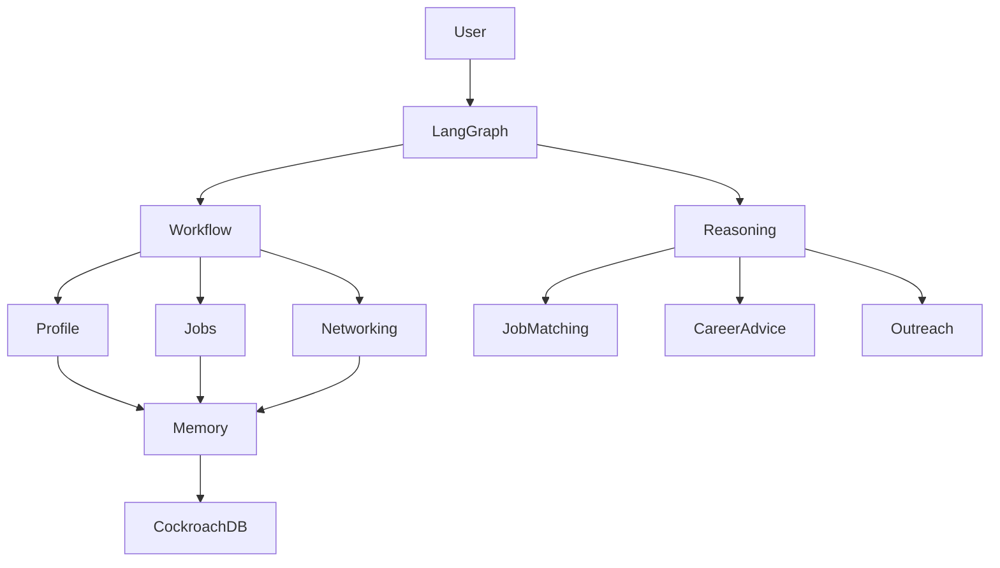

# CareerTrace AI

CareerTrace AI is a memory-powered AI career assistant that helps students discover opportunities, understand job fit, connect with alumni, personalize applications, and manage networking workflows.

The project uses **LangGraph** to combine deterministic workflows with bounded AI reasoning:

- **Deterministic workflows** handle reliable business processes (profile management, database updates, approvals).
- **AI reasoning agents** handle tasks that require flexibility (career advice, job matching explanations, personalized recommendations).

The long-term goal is to build a personalized career agent with persistent memory using **CockroachDB (SQL + Vector Search)**.

---

# Project Architecture

## High-level design



---

# Workflow Design

The system follows an approximately:

```
80% Controlled Workflow
20% Autonomous Reasoning
```

The goal is not to create a fully autonomous agent that makes uncontrolled decisions. Instead, AI reasoning is used only where it provides value.

---

## Controlled Workflow (Deterministic)

These steps follow predictable rules:

### Profile Management

- Upload resume
- Extract resume text
- Extract profile facts
- Ask user for confirmation
- Save confirmed information
- Generate career profile


### Job Search

- Retrieve user profile
- Apply hard filters
- Calculate structured match scores
- Save recommended jobs
- Ask user for selection


Hard filters include:

- Graduation year mismatch
- Location restrictions
- Work authorization requirements
- Internship/full-time mismatch


### Networking

- Retrieve alumni information
- Check previous interactions
- Track outreach status
- Schedule follow-ups


---

## AI Reasoning Components

These tasks require flexible reasoning:

### Career Intelligence

- Explain why a job matches a user
- Identify transferable skills
- Recommend possible career directions
- Suggest missing skills


### Job Search Agent

- Expand user requests into related roles
- Generate better search queries
- Rank opportunities
- Decide which recommendations are most relevant


### Networking Agent

- Find meaningful alumni connections
- Analyze shared experiences
- Generate personalized outreach messages


---

# Current Implementation

## Completed

### Profile Onboarding Workflow

Current LangGraph flow:

```
START
 |
 v
Upload Resume
 |
 v
Extract Resume Text
 |
 v
LLM Extract Facts
 |
 v
User Confirmation
 |
 +---- rejected ----> Edit Profile
 |
 v
Save Confirmed Facts
 |
 v
Generate Career Profile
 |
END
```

The workflow currently supports:

- PDF resume upload
- Resume text extraction
- LLM-based profile extraction
- User confirmation
- Career profile generation

Example generated information:

```json
{
  "strengths": [],
  "possible_roles": [],
  "recommended_next_skills": []
}
```

---

# Planned Development

## Phase 1: Profile Memory

Improve profile storage:

Store:

- Education
- Skills
- Projects
- Experience
- Career strengths
- Recommended roles
- Skill recommendations


Current storage:

```
data/profile_memory.json
```

Future storage:

```
CockroachDB
 ├── SQL tables
 └── Vector embeddings
```

---

## Phase 2: Job Search Agent

Flow:

```
User Request
      |
      v
Retrieve Profile
      |
      v
Apply Filters
      |
      v
Match Jobs
      |
      v
Explain Fit
      |
      v
Save Candidates
```

---

## Phase 3: Alumni Networking Agent

Flow:

```
Company / Job Target
        |
        v
Find Alumni
        |
        v
Analyze Connection
        |
        v
Generate Outreach
        |
        v
Track Follow-up
```

---

# Memory Architecture

The agent will use two types of memory.

## Structured Memory (SQL)

Stores reliable facts:

- User profile
- Skills
- Projects
- Education
- Jobs
- Applications
- Alumni contacts
- Outreach history
- User preferences


## Semantic Memory (Vector Search)

Stores information requiring similarity search:

- Resume sections
- Project descriptions
- Job descriptions
- Alumni profiles
- Previous recommendations
- User feedback/rejected suggestions

---

# LLM Architecture

The project uses different models depending on the task.

```
                 LangGraph

                     |
        +------------+------------+
        |                         |
        v                         v

   Nova Lite              Claude Sonnet

 Cheap / fast             Strong reasoning

 Profile extraction       Job ranking
 Intent detection         Career advice
 Query parsing            Resume tailoring
 Metadata extraction      Outreach writing
```

The goal is to use cheaper models for high-volume simple tasks and stronger models only when deeper reasoning is needed.

---

# Project Structure

```
careertrace-ai/

├── app/
│   ├── main.py
│   │
│   ├── graph/
│   │   └── profile_graph.py
│   │
│   ├── nodes/
│   │   ├── resume.py
│   │   ├── extraction.py
│   │   ├── confirmation.py
│   │   ├── profile.py
│   │   └── memory.py
│   │
│   ├── llm/
│   │   └── model.py
│   │
│   └── state/
│       └── schema.py
│
├── data/
│   └── profile_memory.json
│
├── requirements.txt
├── README.md
└── .gitignore
```

---

# Setup

## 1. Clone repository

```bash
git clone <repository-url>

cd careertrace-ai
```

---

## 2. Create virtual environment

```bash
python -m venv .venv
```

Activate:

### Mac/Linux

```bash
source .venv/bin/activate
```

---

## 3. Install dependencies

```bash
pip install -r requirements.txt
```

---

## 4. Configure environment variables

Create:

```
.env
```

Example:

```env
# AWS Bedrock
AWS_REGION=us-east-1

BEDROCK_MODEL_CHEAP=amazon.nova-lite-v1:0
BEDROCK_MODEL_REASONING=<claude-model-id>


# LangSmith tracing
LANGSMITH_TRACING=true
LANGSMITH_API_KEY=<your-key>
LANGSMITH_PROJECT=CareerTrace
```

---

# Running the Current Workflow

Place a resume PDF in:

```
data/
```

Example:

```
data/resume.pdf
```

Run:

```bash
python -m app.main data/resume.pdf
```

The workflow will:

1. Extract resume information
2. Ask for confirmation
3. Generate a career profile
4. Save memory

---

# Development Notes

## Current priority

1. Complete profile memory
2. Add Streamlit web interface
3. Build job search workflow
4. Add CockroachDB memory layer
5. Add autonomous reasoning components

---

# Technology Stack

- **LangGraph** — agent workflow orchestration
- **Amazon Bedrock** — LLM inference
- **LangSmith** — tracing and debugging
- **CockroachDB** — persistent memory (planned)
- **Vector Search** — semantic retrieval (planned)
- **Streamlit** — web interface (planned)