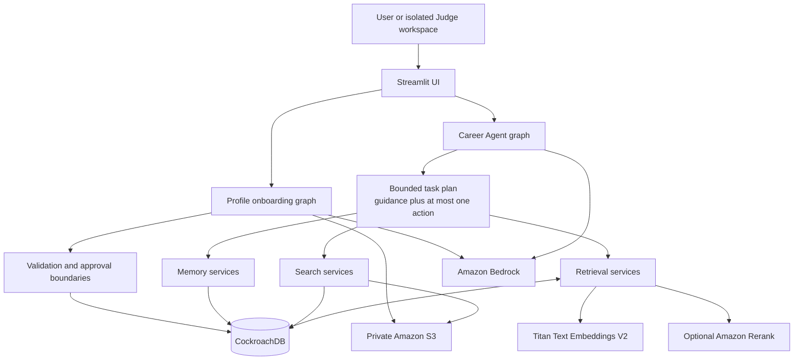

# CareerTrace Architecture

CareerTrace is a controlled career assistant with durable, user-approved memory.
Models classify and generate; deterministic code owns validation, authorization,
persistence, limits, and approval boundaries.



## Controlled agent workflow

The Career Agent keeps its existing closed intent and tool boundaries. A
request-level plan can contain multiple guidance tasks and at most one
tool-backed action. Explicit people or job requests are validated against the
original user text so the planner cannot silently omit or invent an action.

The existing model/tool loop executes the selected action. A deterministic
completion observer allows final composition only after every planned task is
`completed`, `partial`, or `blocked`. Two simultaneous tool-backed requests,
such as people search plus job search, require clarification.

## Profile memory

Profile contains canonical facts such as school, major, graduation year,
skills, projects, and experience.

1. Original PDF or DOCX files are stored privately in S3.
2. Bedrock proposes structured facts from extracted document text.
3. Deterministic validation checks required fields and shapes.
4. The user edits and confirms the facts.
5. CockroachDB stores an immutable `profile_versions` snapshot and points
   `profiles.current_version_id` to the active version.
6. Conversation-derived Profile changes become field-level
   `ProfileRevisionDraft` records; they never overwrite Profile automatically.

## Semantic memory lifecycle

Semantic Memory stores durable subjective context that does not belong in the
canonical Profile, including preferences, goals, constraints, interests,
values, and other normalized open groups.

```text
User statement
  → conversation boundary
  → LLM proposals + explicit deterministic signals
  → shared proposal representation and deduplication
  → evidence, ownership, and schema validation
  → pending MemoryCandidate
  → user approval
  → SemanticMemory
  → retrieval index
```

`semantic_group` is an open normalized string, not a closed enum. `topic_key`
is reused or proposed only when the evidence supports a sufficiently specific
topic. Approved updates retain same-type supersession history.

## Episodic memory lifecycle

Episodic Memory records career events separately from subjective context.
Candidate events may be `completed`, `current`, `planned`, or `unknown`.
Temporal values are retained only when they are grounded in the source message.

The same conversation-boundary, validation, review, approval, and indexing
steps apply, but approval creates a `CareerEvent`. A career event can supersede
only another career event.

## Approval and recovery

- Pending candidates are not durable personalization context.
- Memory candidates and Profile revision fields are approved or rejected in the
  UI; accepted Profile fields require a separate apply action.
- Provenance retains the source conversation, source message IDs, and exact
  evidence text.
- Extraction watermarks and runs are persisted, so failed or interrupted work
  can retry after login without duplicating candidates.
- Every private repository operation is scoped to the authenticated `user_id`.

## Retrieval flow

Approved Profile, Semantic Memory, and Career Event records are indexed into
the shared `retrieval_documents` corpus.

1. Structure-aware chunking creates bounded retrieval documents.
2. Titan Text Embeddings V2 produces 1,024-dimensional vectors.
3. CockroachDB full-text and vector searches run independently.
4. Reciprocal Rank Fusion combines sparse and dense rankings.
5. Amazon Rerank may rerank the shortlist when enabled.
6. The assistant receives compact memory cards and expands at most three
   selected memories.
7. The UI can display the Profile and approved-memory references used for the
   response.

If embedding or reranking is unavailable, structured Profile data and sparse
retrieval remain available. Index failures are recorded instead of silently
discarding approved memory.

## Persistence and cloud services

- **CockroachDB:** users, profiles and versions, conversations, candidates,
  semantic memories, career events, retrieval documents, search state, agent
  runs, and deployed LangGraph checkpoints.
- **Amazon Bedrock:** low-cost structured classification/extraction and stronger
  response generation.
- **Amazon Titan Text Embeddings V2:** dense retrieval vectors.
- **Amazon S3:** encrypted private documents and large evidence objects.
- **Amazon Rerank:** optional shortlist reranking in `us-west-2`.

The application and Cockroach checkpoint saver share the same TLS
`verify-full` database URL. Deployment secrets are runtime configuration and
are not committed.
